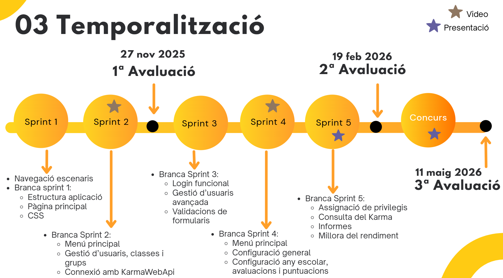

# 🚀 Sprints del projecte Karma Cli

El desenvolupament del projecte **KarmaCli – Quin Karma tinc hui?** s’organitza en diferents sprints, amb l’objectiu de construir l’aplicació de manera progressiva al llarg del curs.

---
## 📊 Visió general dels sprints

<!-- 👉 ACI HAS D'INSERIR LA IMATGE DE RESUM DELS SPRINTS -->
<!-- Pots posar-la així: -->

En la imatge anterior es mostra una visió global de l’evolució del projecte al llarg dels diferents sprints, així com la seua distribució temporal.

---
## 📅 Organització temporal

Els sprints es distribueixen al llarg de les dues avaluacions. La 3ª avaluació es dedicarà al concurs.

### 🧪 1ª avaluació  - 27 novembre 2025
- [Sprint 1](./_aux/sprint1.md)
- [Sprint 2](./_aux/sprint2.md)

### 🧪 2ª avaluació - 19 febrer 2026
- [Sprint 3](./_aux/sprint3.md)
- [Sprint 4](./_aux/sprint4.md)
- [Sprint 5](./_aux/sprint5.md)

### 🧪 3ª avaluació - 11 maig 2026
- [Concurs](./_aux/concurs.md)

---
## 🧩 Enfocament del projecte

El projecte es desenvolupa de manera incremental, partint des de zero l i ampliant-la en cada sprint.

Aquesta estructura permet:

- Treballar els continguts de forma aplicada  
- Desenvolupar funcionalitats reals des del primer moment  
- Rebre retroalimentació contínua  
- Millorar el projecte de forma progressiva  

D’aquesta manera, l’alumnat pot entendre millor la relació entre el que aprén i la seua aplicació pràctica.

Cada sprint inclou:

- Objectius específics  
- Continguts treballats  
- Descripció de les activitats  
- Productes a lliurar  

A més, dins de cada document es pot navegar fàcilment entre sprints per facilitar la consulta.

---

## ✅ Consideracions finals

Aquest plantejament permet adaptar el projecte al ritme d’aprenentatge de l’alumnat, alhora que facilita al professorat el seguiment del progrés i l’avaluació contínua.

El projecte no es planteja com una sèrie d’activitats independents, sinó com un desenvolupament complet que evoluciona al llarg del curs.